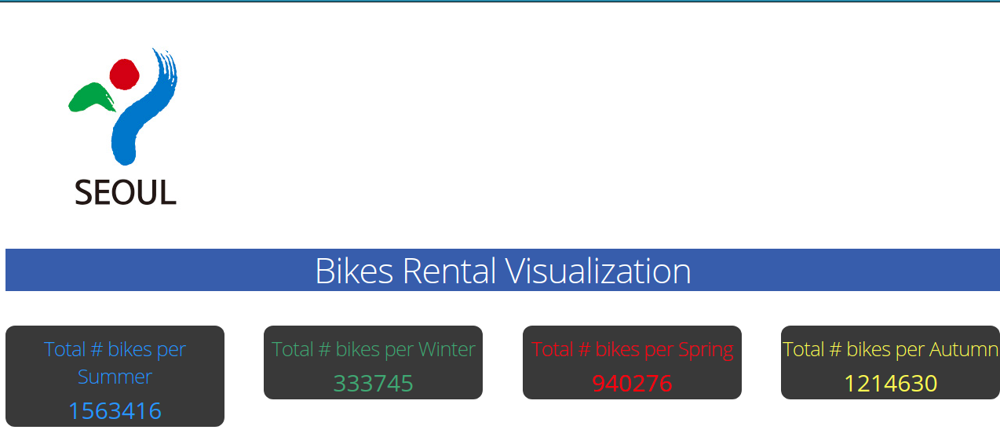
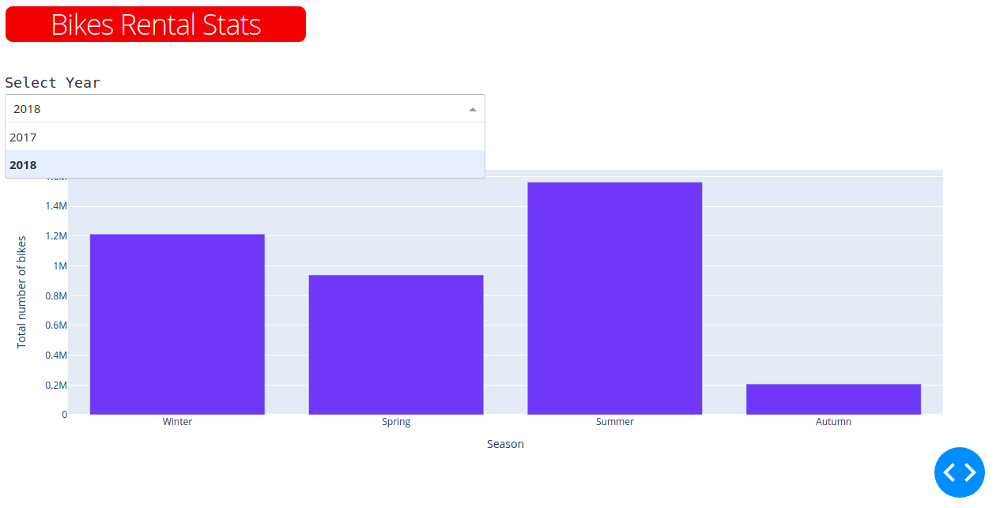
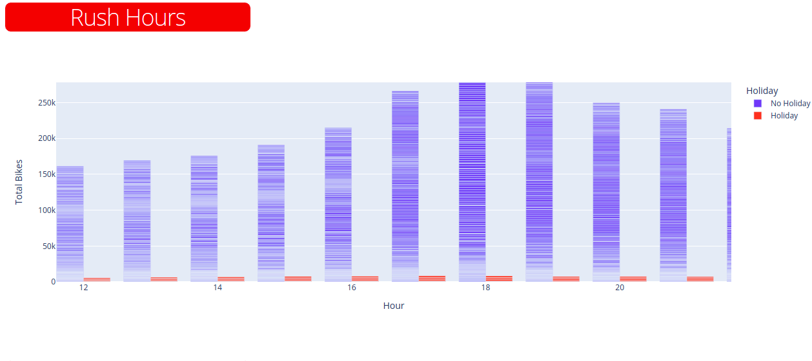
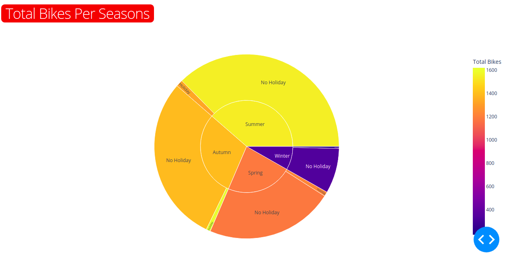

# Bikes-Rental-Dashboard-using-Dash-and-Plotly

## This Project is Part of Data Visualization Course in ITI AI-Pro Program

### Team Members:

**Omar Mohamed**

**Hesham Tarek**

Seoul Bike Rental Dashboard discover some insights of the dataset using dash and plotyl libraries in python

link dataset : https://www.kaggle.com/c/seoul-bike-rental-ai-pro-iti/data

## [Dashboard](https://github.com/omarmohamed10/Bikes-Rental-Dashboard-using-Dash-and-Plotly/blob/main/Plotly-Project.ipynb) :

